# Lyra

## Login credentials:

### Desktop   
* Username: desktop
* Password: test

### Mobile
* Username: mobile
* Password: test

#### Napomena

Kako bi se zaobišlo predugo čekanja prilikom migracije .mp3 fileova, u folderu [TestAssets](./TestAssets) se nalaze 3 stock mp3 file-a koji će služiti za testiranje.

### Desktop

<table>
    <tr>
        <td>
            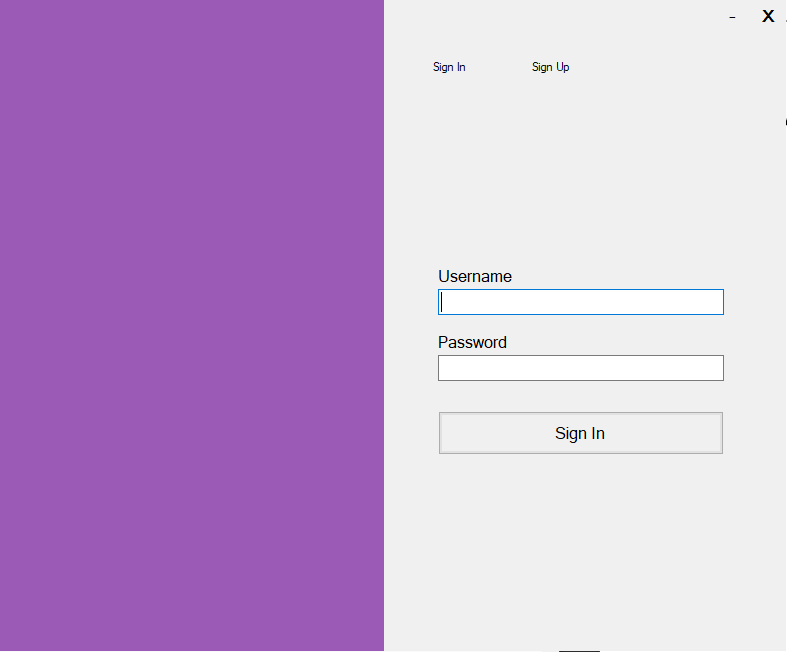
        </td>
        <td>
            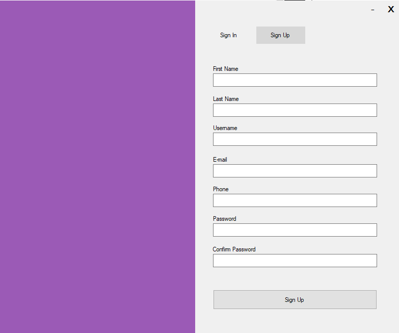
        </td>
    </tr>
    <tr>
        <td>
        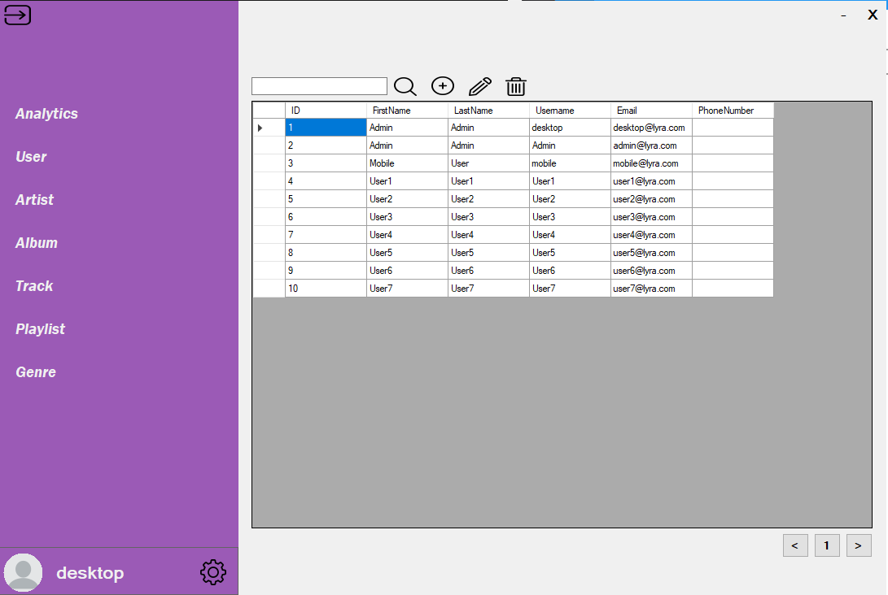
        </td>
        <td>
            
        </td>
    </tr>
     <tr>
        <td>
        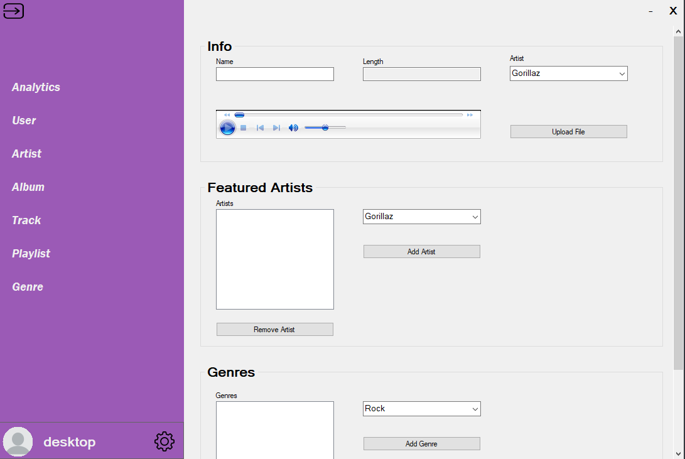
        </td>
        <td>
            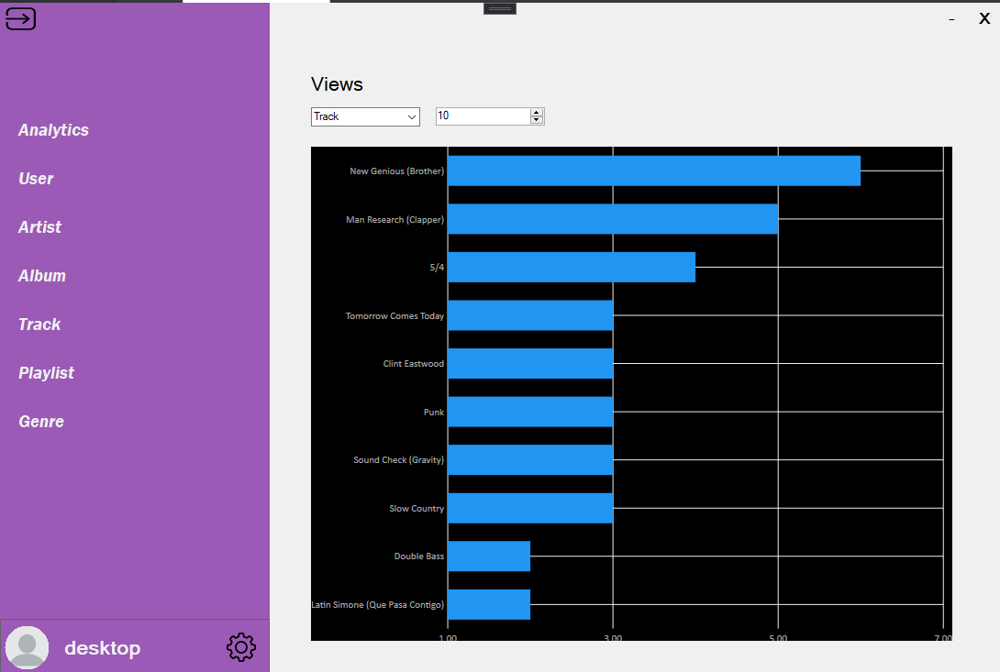
        </td>
    </tr>
</table>

### Mobile

<table>
    <tr>
        <td>
            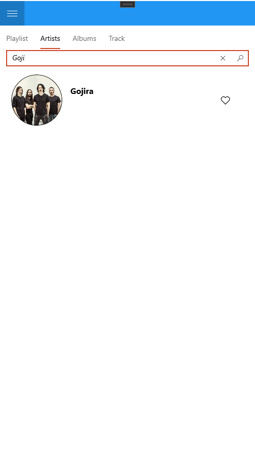
        </td>
        <td>
            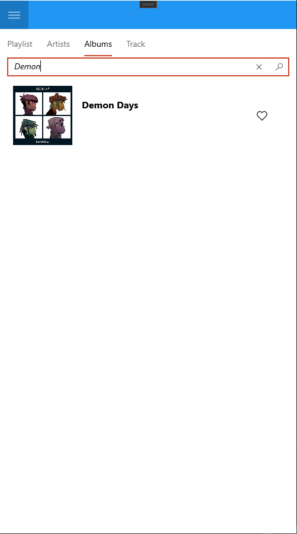
        </td>
    </tr>
     <tr>
        <td>
            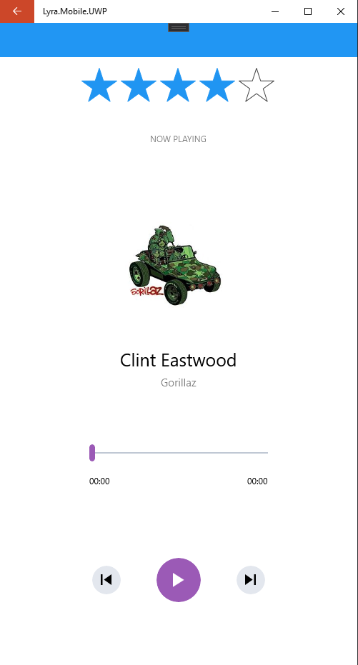
        </td>
        <td>
             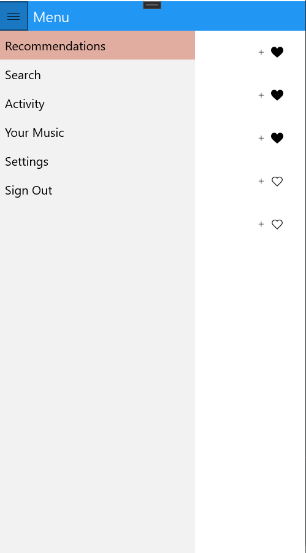
        </td>
    </tr>
    <tr>
        <td>
           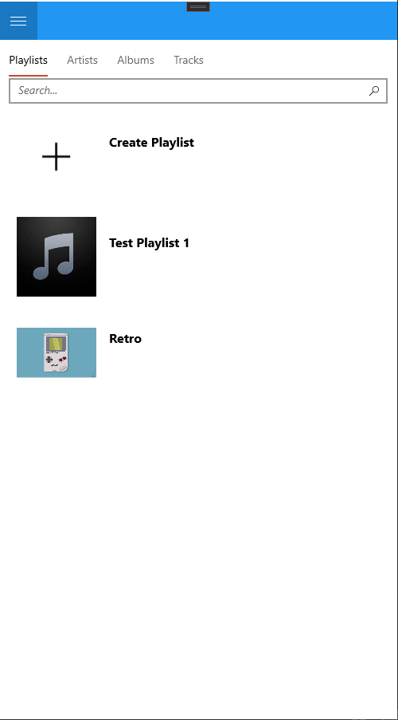
        </td>
        <td>
            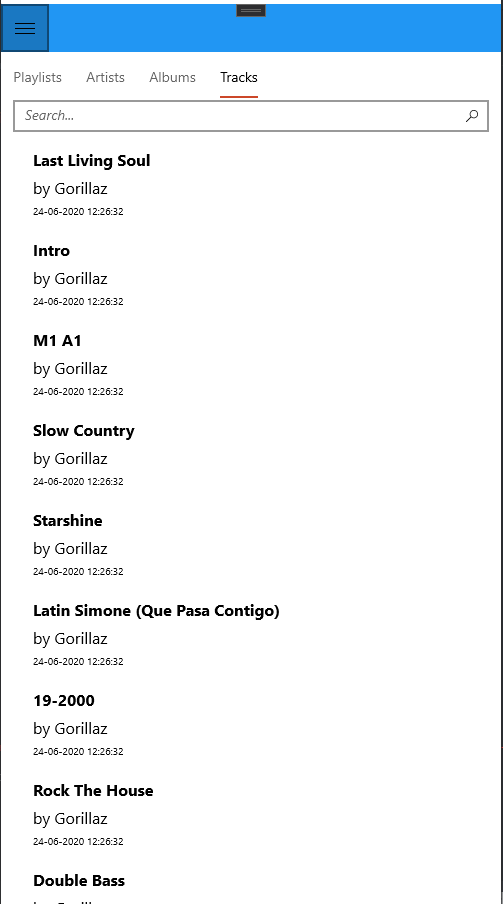
        </td>
    </tr>
     <tr>
        <td>
            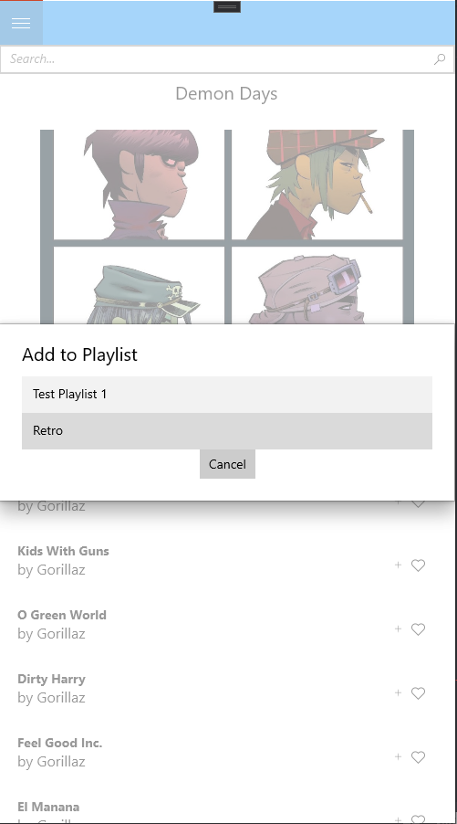
        </td>
        <td>
           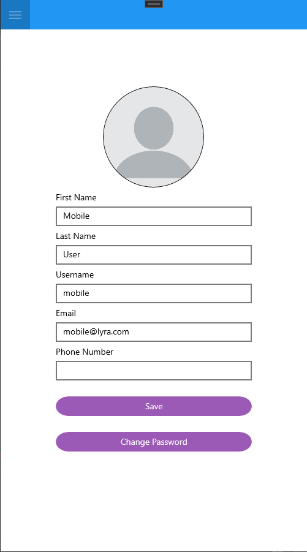
        </td>
    </tr>
    <tr>
        <td>
            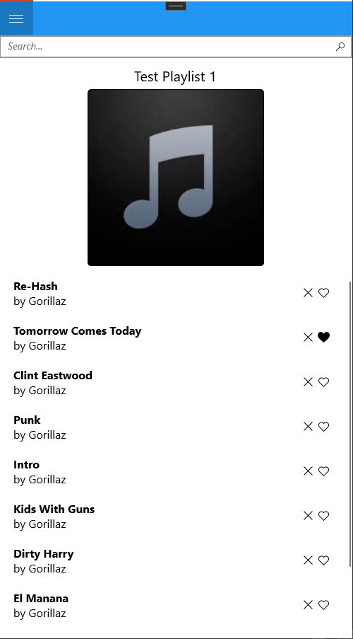
        </td>
    </tr>
</table>